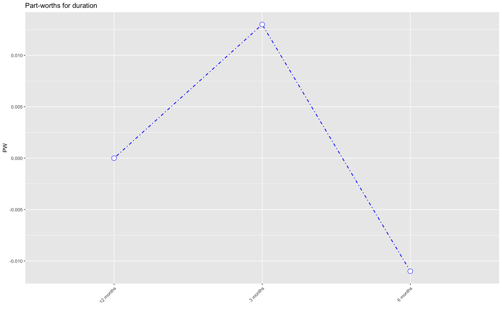
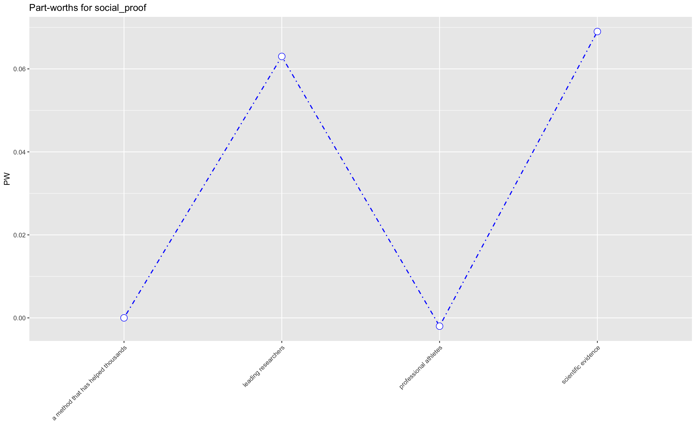
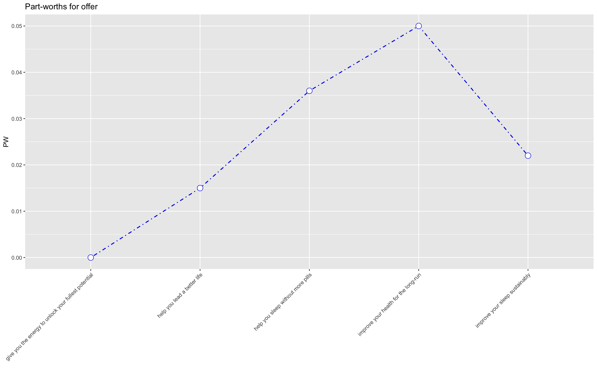
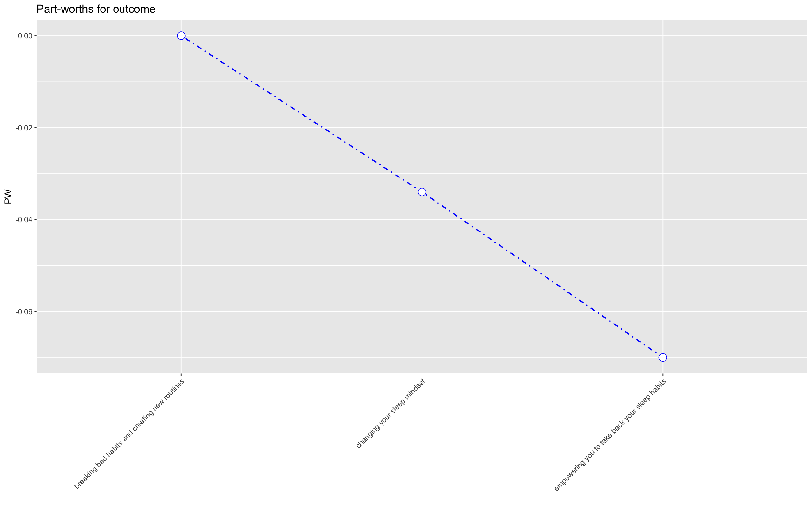
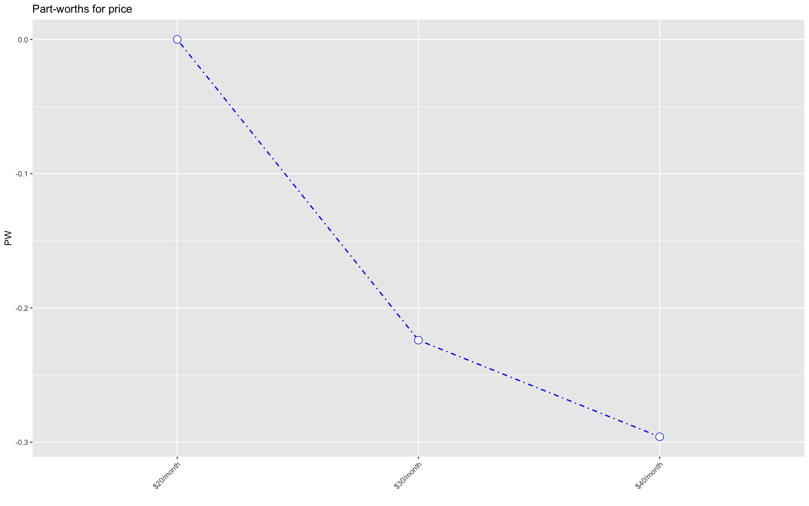
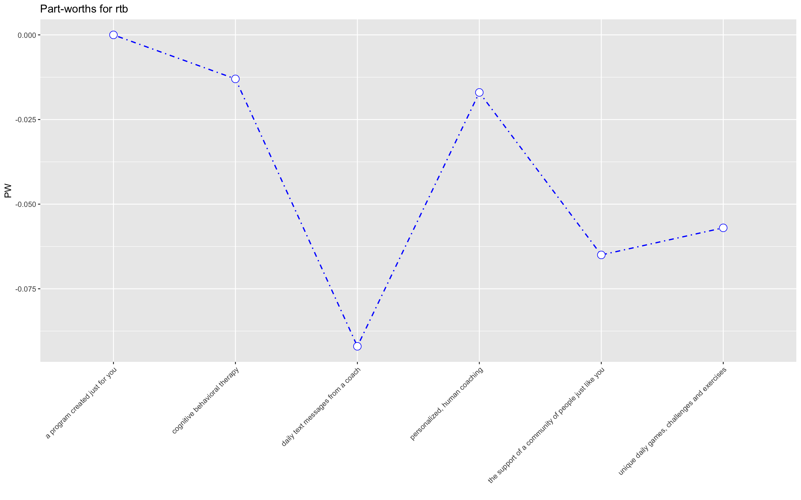
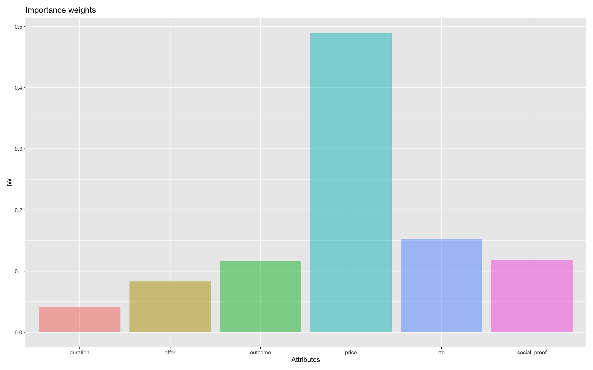

```{r, include = FALSE}
knitr::opts_chunk$set(
  collapse = TRUE,
  comment = "#>",
  cache = TRUE,
  echo = TRUE,
  warning = FALSE,
  message = FALSE)
```

```{r setup, message=FALSE}
library(sleepAppDenali)
library(haven)
library(tidyverse)
library(dplyr)
library(radiant)
library(conjoint)
library(rsample)
library(ranger)
library(cluster)
library(factoextra)
```
# Introduction

The two tasks at hand are: understanding how each attribute and level impact a user’s likelihood of downloading the sleeping app and understanding the demographics of our respondents. I created six different functions to aid in this process. These functions serve the purpose of preparing the data for use in the `"conjoint"` and `"cluster"` package. The function `"fromCharToFactorNum"` converts a character object into a numeric factor. `"getProfs"` creates a data frame of the profiles that appear in the experimental design. `"getAllProfs"` creates a data frame of all of the possible profiles from the combination of attributes. “getLevels” takes in a character list of attributes and a dataset and returns the levels in the order that they appear when using the `"fromCharToFactorNum."` Finally, `"getPredictedPrefs"` takes in attributes, a string of the column name for identification, a string of the column for answers, a data frame of all of the possible profiles, the experimental data, and the survey data. `"getPredictedPrefs"` creates a random forest model using the `"ranger"` package, tests the model, then trains on the entire dataset. Finally, the function predicts the result of all possible combinations for all respondents. The function returns a data frame of this information.

# Load Data
```{r}
data("expData")
data("surveyData")
```

# Basic Conjoint Analysis

First, we will conduct a basic conjoint analysis given the data. We can obtain the profiles using the `"getProfs"` function. This takes the attributes of the experiment, so let’s define the attributes and obtain the profiles.

```{r}
attributes <- colnames(expData)[3:8]
experimentProfiles <- getProfs(attributes, 
                               expData)
```
We then create the data frame of preferences based on the profiles.
```{r, warning=FALSE, message=FALSE}
experimentPreferences <- getPrefs(attributes, 
                                  experimentProfiles, 
                                  idColumnName = "response_id", 
                                  answerColumnName = "answer", 
                                  expData)
```
Finally, we just need to create a data frame of the levels in-order that they appear in the dataset. We can use `"getLevels"` for this.
```{r}
experimentLevels <- getLevels(attributes, 
                              expData)
```
After all of our data is clean and we’ve created `"experimentProfiles"`, `"experimentPreferences"`, and `"experimentLevels"`. We can use the `"conjoint"` package to get the individual utilities, the part-worth utilities of the attribute levels, and the importance of each attribute.
```{r, warning=FALSE}
experimentLevels <- as.data.frame(experimentLevels)
experimentPreferences <- as.data.frame(experimentPreferences)
experimentProfiles <- as.data.frame(experimentProfiles)

individualUtilities <- caPartUtilities(y = experimentPreferences, 
                                       x = experimentProfiles, 
                                       z = experimentLevels)

```

The next chunk of code will not be run, but the images and results are included to show what happens. I am not running this code, because `"conjoint"` requires a specific parent environment to work properly.
```{r, eval=FALSE}
conjointBasic <- conjoint(expData,
                          rvar = "answer",
                          evar = attributes)

pwPlots <- plot(conjointBasic,
                custom = TRUE)

iwPlots <- plot(conjointBasic,
                plots = "iw")
```

HEre we can see that the optimal amount of time for a subscription is likely to be the shortest period of time, 3 months. A 6 month subcription is the worst, while a full year subscription is somewhere in the middle.

For ``"social_proof"` we see that scientific evidence and leading research are the best levels for consumers. They are very close as well. The language of "a method that has helped thousands" and "professional athletes" do not resinate with the respondents.

The best level for `"offer'" is "improve your health for the long run. Improving sleep naturally and a promise of a healthier future resonate with respondents the most.

Respondents really want to create new routines and get rid of the old ones.

Of course, respondents are wanting this app for the cheapest price possible.

Repsondents want something personal to them. They want specific catered programming.

Finally, as we might have guessed, the cost of the app is the most important things to consumers. They want an app that does not require a lot of dedication, backed by science, catered specifically to them, that will help them to grow healthier, and all at a low cost.


# Clustering by Duration and Price

We choose to cluster based on the individual utitilities for respondents of duration and price, because these are the utilities that we have for all individuals.
```{r}
responseIds <- unique(expData$response_id)

durationAndPrice <- as.data.frame(individualUtilities) %>%
  bind_cols("response_id" = responseIds) %>%
  select(response_id, intercept, `3 months`:`12 months`, `$30/month`:`$20/month`) %>%
  na.omit()

rownames(durationAndPrice) <- c()

durationAndPrice <- durationAndPrice %>%
  column_to_rownames(var = "response_id") %>%
  scale()

```

```{r}
set.seed(123)

fviz_nbclust(durationAndPrice, 
             kmeans, 
             method = "wss")

durationPriceCluster <- kmeans(durationAndPrice, 
                               4, 
                               nstart = 25)

```
As we can see from above the optimal number of clusters is likely about 4. However, as we can see below, the clusters do not look entirely too distinct.
```{r}
fviz_cluster(durationPriceCluster, 
             data = durationAndPrice,
             geom = "point")
```
We have one cluster of only size one, so this is no good. Let's try imputing some values into our preference matrix to get a better clustering with more individual utilties.

# Imputed Values Conjoint
Now, our basic conjoint analysis might be a little limited due to the fact that each respondent did not see every profile. From an experimental design standpoint, this makes sense as there are a total of 3,240 possible profiles. But, hey, we have a lot of data, we should be able to predict what the respondents would say for each profile. In-order to do this, we first need to create a data frame of all of the possible profiles. We can use `"getAllProfs"` for this. Because we are predicting every possible combination of attributes and for each individual we need to redefine our attributes to include `"response_id"`.

```{r}
attributesFull <- colnames(expData)[c(1, 3:8)]
```
Then we can use the function.
```{r}
completeProfs <- getAllProfs(attributesFull, 
                             idColumnName = "response_id", 
                             expData, 
                             replaceNames = FALSE)
```
We supply the name of the column that is the identifier for respondents, the data frame of the experiment, and `"replaceNames"` = TRUE to keep the same level names.
Now, we can use the function `"getPredictedPrefs"` to impute our missing values.
```{r, warning=FALSE}
completePrefs <- getPredictedPrefs(attributesFull, 
                                   completeProfs, 
                                   idColumnName = "response_id", 
                                   answerColumnName = "answer", 
                                   expData %>% select(-task), 
                                   surveyData)
```
The above is computationally expensive due to the number of possible combinations, so it may take some time to run. After it has run, we can repeat the above conjoint analyses using the results.
```{r}
completePrefs <- as.data.frame(completePrefs)
completeProfs <- as.data.frame(completeProfs)
experimentLevels <- as.data.frame(experimentLevels)

completeIndividualUtilities <- caPartUtilities(y = completePrefs, 
                                               x = completeProfs, 
                                               z = experimentLevels)

```

# Clusering by All Attributes

Now, we have a utility score for every individual within the dataset and for all levels of all attributes. Let's cluster on those. First we prep a dataset. We set the `"response_id"` as the row names so we can keep track of them throughout the process.
```{r}
allAttributes <- as.data.frame(completeIndividualUtilities) %>%
  bind_cols("response_id" = responseIds) %>%
  na.omit()

rownames(allAttributes) <- c()

allAttributes <- allAttributes %>%
  column_to_rownames(var = "response_id") %>%
  scale()

```

Again, lets use the elbow method to predict what the optimal number of clusters would be.
```{r}
set.seed(123)

fviz_nbclust(allAttributes, 
             kmeans, 
             method = "wss")

allAttributesCluster <- kmeans(allAttributes, 
                               3, 
                               nstart = 25)
```
Based on the elbow method, we are training with 4 clusters. Let's visualize those clusters.

```{r}
fviz_cluster(allAttributesCluster, 
             data = allAttributes,
             geom = "point")
```

# Demographics from Clustering
Now that we have some more distinct and larger clusters. We can get some demographic data based on those clusters.
```{r}
clusteredSurveyData <- surveyData

for(i in 1:ncol(clusteredSurveyData)){
  clusteredSurveyData[is.na(clusteredSurveyData[,i]), i] <- 0
}

clusteredSurveyData <- clusteredSurveyData %>%
  mutate_at(colnames(clusteredSurveyData)[2:97], as.numeric)

clusteredSurveyData <- clusteredSurveyData[,-1]

clusteredSurveyData <- clusteredSurveyData %>%
  select(-weights) %>%
  bind_cols(cluster = allAttributesCluster$cluster) %>%
  group_by(cluster) %>%
  mutate_at(colnames(clusteredSurveyData)[1:26], getMode) %>%
  mutate_at(colnames(clusteredSurveyData)[27:38], sum) %>%
  mutate_at(colnames(clusteredSurveyData)[39], getMode) %>%
  mutate_at(colnames(clusteredSurveyData)[40:68], sum) %>%
  mutate_at(colnames(clusteredSurveyData)[69:98], getMode) %>%
  ungroup() %>%
  distinct()
  
clusteredSurveyData
```


# Overall Conclusion
As stated earlier, our respondents are looking for an app that does not require a lot of dedication, backed by science, catered specifically to them, that will help them to grow healthier, and all at a low cost. They are driven by the price of the app, but they are also driven by the possibility of a personalized app that has a big scientific backing.


Looking back, I wish I would have had more time to examine the demographics by cluster more. I also think this package needs some work before it can be used on other similar datasets. While I did a lot of testing and debugging using the `"browser"` function, I did not have time to formally document those tests. This is due to the large amount of focus that went into creating a function to predict all preferences for all possible profiles. I was very happy with that function and the relatively high R-Squared and low MDAPE and MAPE of the random forest model. However, due to the computation expense on my 2015 Macbook, it took hours to debug.

# Personal Reflection
This was an interesting process for me. I have worked on R packages before, but I have not created a data analysis as a vignette before. I spent a lot of time trying to think of a clever way to get more information from our individual. I was pretty happy with the idea of training a random forest model to impute the missing values. I thought this was clever, because the random forest model would be able to maintain the integrity and pattern of the data for individuals. It also allowed for better clustering. I am very interested in the methods that Gradient Metrics used for the cluster analysis section. I hope that I can work with you all in the future. I hope that this package, the vignette, and the functions show that I can be very creative when it comes to new techinques and data analysis in-general. I am still learning, as we all should. I hope to hear back from you soon.